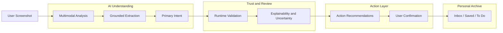

# AI Inbox

<!-- markdownlint-disable MD013 -->

**Turn screenshots into useful actions.**

AI Inbox is an AI-powered screenshot organization assistant. It understands saved screenshots, extracts meaningful information, classifies user intent, and turns passive screenshots into actionable workflows.

Designed as an AI Product Manager portfolio project, the prototype explores how multimodal AI can transform an everyday behavior—taking screenshots—into a calm, useful personal organization experience.

---

## Problem

People save hundreds of screenshots:

- Travel ideas
- Products they may want to buy
- Events and bookings
- Tasks and reminders
- Notes, recommendations, and reading lists

But screenshots quickly become a forgotten information graveyard. They are difficult to search, disconnected from the user’s next step, and rarely revisited when they would be useful.

---

## Solution

AI Inbox transforms screenshots into structured personal knowledge.

It combines screenshot understanding with an intent-based action layer to:

- Understand screenshot content with Vision AI
- Classify the user’s likely intent automatically
- Extract useful, grounded information
- Explain how the content was organized
- Recommend relevant next actions while keeping the user in control

---

## User Journey

1. **Capture** — The user uploads or pastes a screenshot they want to keep.
2. **Understand** — Vision AI identifies the content, extracts grounded details, and selects one primary intent.
3. **Review** — The user sees the organized result, supporting signals, and any missing information.
4. **Act** — AI Inbox suggests a small set of relevant actions such as saving a place, creating a reminder, or adding an event.
5. **Revisit** — The item remains available in the user’s Inbox, Saved archive, or To Do list.

The experience is designed to turn a familiar, low-effort behavior into an organized and reusable personal memory system.

---

## Product Demo

> **Demo GIF coming soon**

The core experience follows one clear flow:

```text
Upload screenshot
        ↓
AI understanding
        ↓
Intent classification
        ↓
Action suggestion
```

The portfolio demo includes five representative scenarios: an event, a task, a place recommendation, a product, and a reading list.

---

## Key Features

### AI Screenshot Understanding

Vision AI analyzes screenshots directly and extracts the visible context without requiring a separate OCR workflow.

### Smart Intent Classification

AI Inbox organizes content around what the user may want to do next:

- **Attend** — events, appointments, and scheduled activities
- **Do** — tasks and reminders
- **Go** — restaurants, destinations, and places
- **Shop** — products to save, compare, or research
- **Remember** — notes, recommendations, and useful knowledge

### Explainable AI

Each result highlights the signals that informed its category, helping the user understand and review the AI’s interpretation without exposing raw model reasoning.

### Action Layer

AI Inbox turns recognized information into useful next steps:

- Add Calendar
- Set Reminder
- Open Map
- Research Product or Trip
- Save for later

Actions are suggested—not automatically executed—so the user remains in control.

### Persistent Personal Archive

Screenshots and structured results remain available across Inbox, Saved, and To Do views through an anonymous, user-isolated Supabase session.

---

## Product Decisions

- **Organize by intent, not source app.** A restaurant recommendation is categorized as **Go** whether it came from Xiaohongshu, WeChat, or a browser.
- **Choose one primary intent.** A clear category reduces cognitive load and makes the next action easier to understand.
- **Prefer missing data over invented data.** Unknown dates, prices, or addresses remain empty until the user confirms them.
- **Treat confidence as guidance.** Uncertainty changes the review experience; it is not presented as a precise probability.
- **Suggest before executing.** Calendar, reminder, map, and research actions remain under user control.
- **Keep the first experience frictionless.** Anonymous authentication creates an isolated personal workspace without introducing a login screen.

---

## Architecture



The product separates AI understanding from user-facing actions. Model output is normalized into a provider-independent contract, validated before display, and reviewed by the user before an external action is triggered.

---

## Tech Stack

| Layer | Technology |
| --- | --- |
| Frontend | Next.js App Router, TypeScript, Tailwind CSS, shadcn/ui |
| Backend | Next.js API Routes |
| Database | Supabase PostgreSQL |
| Storage | Supabase Storage |
| Authentication | Supabase Anonymous Auth |
| AI | Zhipu GLM-4.5V Vision API |
| Deployment | Vercel |

---

## Design Philosophy

AI Inbox focuses on:

- **Calm personal organization** — a warm visual archive instead of a technical AI dashboard
- **Explainable AI** — clear category signals and uncertainty handling
- **Action-oriented workflows** — helping users move from saved information to a useful next step
- **User control** — confirmation before meaningful actions are executed
- **Reduced information overload** — organizing screenshots by intent rather than source application

---

## Future Improvements

- Better OCR and mixed-layout extraction
- Personalized AI suggestions based on user behavior
- Cross-platform screenshot sync
- Native calendar and productivity integrations
- Live web research with clear source attribution

---

## Running Locally

```bash
pnpm install
pnpm dev
```

Environment variable names and Supabase setup instructions are documented in `.env.example` and `supabase/README.md`. Secret values are never committed to the repository.
